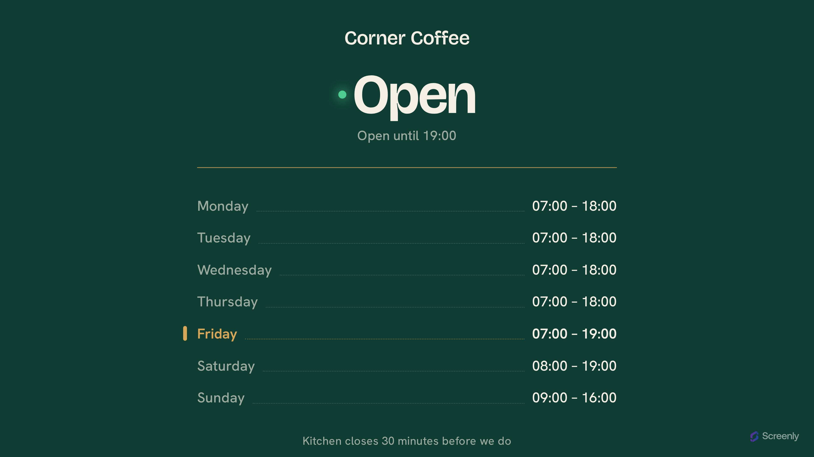

# Screenly Opening Hours App

A full-screen opening-hours board for retail and hospitality displays. It shows
the week's hours with **today highlighted**, and answers the customer's real
question — *are you open right now?* — with a big status the whole board is tinted
to match: deep storefront green when you're **Open**, dimmed aubergine when
you're **Closed**, legible from across a room.



Live: **https://opening-hours.srly.io**

Part of the Screenly signage family alongside the [quotes](../quotes),
[weather](../weather-app) and [clock](../clock-app) apps. Like Quotes, this is a
fully **static** site hosted on **GitHub Pages** — there's no server. Unlike
Quotes it takes **settings**: a shop's hours arrive entirely in the launch URL's
query string, so one deployment serves every business.

## How the data works

Everything is passed as query parameters — one per weekday, plus a few extras:

```
https://opening-hours.srly.io/?name=Corner+Coffee&tz=Europe/London
  &mon=07:00-18:00&tue=07:00-18:00&wed=07:00-18:00&thu=07:00-18:00
  &fri=07:00-19:00&sat=08:00-19:00&sun=09:00-16:00
  &note=Kitchen+closes+30+minutes+before+we+do
```

| Param | Meaning |
| --- | --- |
| `name` | Business name shown at the top |
| `mon`…`sun` | That day's hours, e.g. `09:00-17:00`. Comma-separate for a midday break: `09:00-12:00,13:00-17:00`. A range that ends before it starts (`18:00-02:00`) runs past midnight. Omit a day, or leave it blank, to show **Closed**. |
| `tz` | IANA time zone (e.g. `America/New_York`) used to decide whether you're open *now* |
| `format` | `12` or `24` to force the clock format; omitted, it's inferred from `tz` |
| `note` | Optional line under the hours |

Opened with no parameters (e.g. the store preview), it shows a worked example so
the board is never blank. The **Open / Closed** status and the today marker
recompute in the browser and repaint every minute, so they flip exactly on the
boundary without a reload.

The [app-store manifest](.well-known/signage-app.json) declares these as typed
settings and a launch template, so the store renders the config form and builds
the URL for you — see [`docs/app-manifest.md`](../app-store/docs/app-manifest.md).

## Stack

- **Bun** — package manager, bundler, and test runner (no npm/npx)
- **TypeScript** — all app JS, strict mode
- **Tailwind CSS v4** — CSS-first config (`@theme`), compiled by the Tailwind CLI
- **Biome** — lint + format
- Self-hosted variable fonts (Bricolage Grotesque, Hanken Grotesk), vendored from `@fontsource`

## Develop

```sh
bun install        # install deps (fonts get vendored during build)
bun run dev        # build, then serve dist/ locally
bun run build      # build the static site into dist/
bun test           # run unit tests (parsing, status, manifest)
bun run typecheck  # tsc --noEmit
bun run lint       # Biome (lint:fix / format to auto-fix)
```

`bun run build` is non-destructive: it assembles everything into `dist/`
(gitignored) — copies `index.html`, static assets and the `.well-known/`
manifest, compiles Tailwind, bundles the TypeScript, stamps a content-hash `?v=`
onto asset URLs for cache-busting, and writes the `CNAME`.

## Supported resolutions

The layout is fluid (one `clamp()`-driven root size, orientation-neutral).
Verified landscape **and** portrait across:

| Resolution | Notes |
| --- | --- |
| 4096×2160 · 3840×2160 (+ portrait) | 4K |
| 1920×1080 (+ portrait) | 1080p |
| 1280×720 (+ portrait) | 720p |
| 800×480 (+ portrait) | Raspberry Pi Touch Display |

## Deploy

Push to `master` runs `.github/workflows/deploy-pages.yml`, which builds and
publishes `dist/` to GitHub Pages. CI (`ci.yml`) typechecks, lints, tests, and
builds on every PR.

One-time setup (outside this repo):

1. **DNS:** `CNAME` record `opening-hours.srly.io → screenly-labs.github.io`.
2. **Repo → Settings → Pages:** Source = "GitHub Actions"; set the custom domain
   to `opening-hours.srly.io` and enable "Enforce HTTPS" once the certificate
   provisions.

## License

AGPL-3.0-only (see `LICENSE`).
